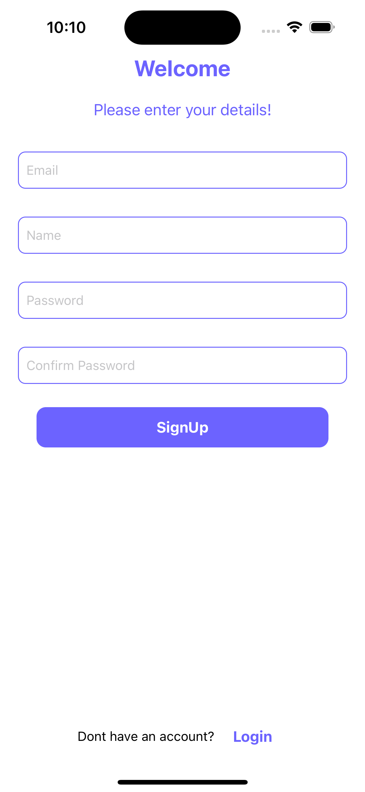
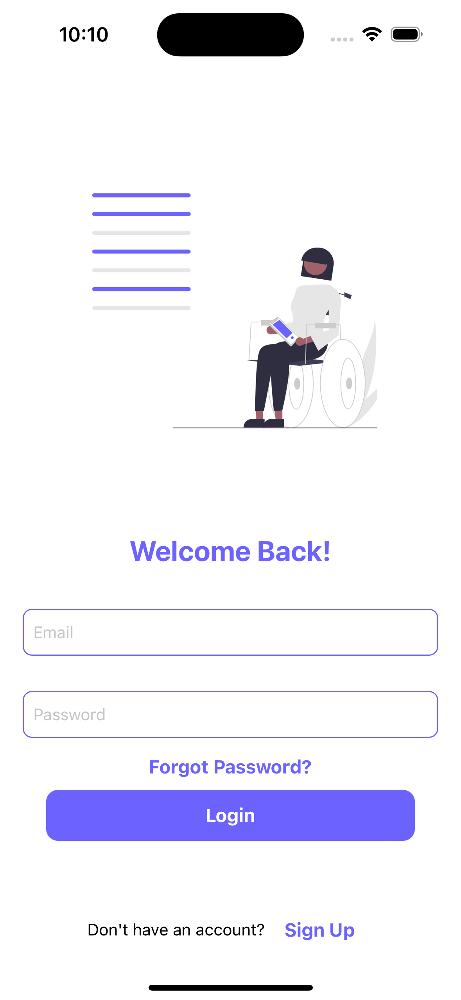
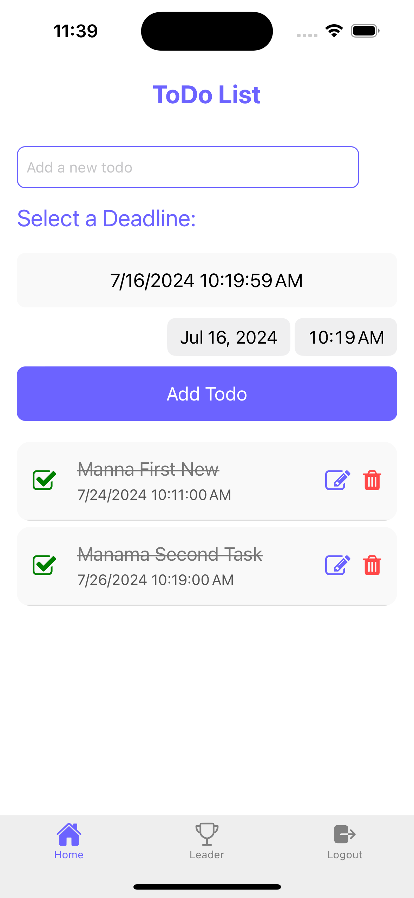
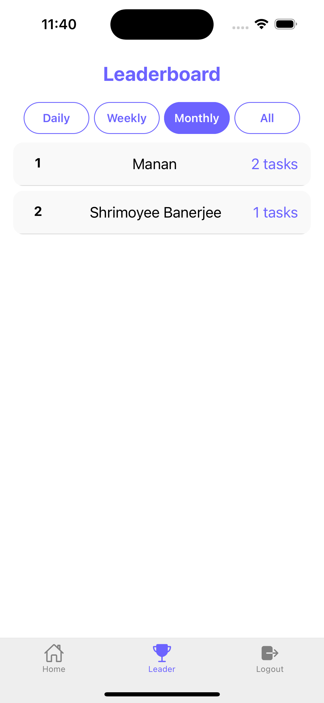

# Task Management App

## Description
A comprehensive task management application that allows users to create, update, delete, and manage their tasks. It integrates Firebase for authentication, Firestore for data storage, and Firebase Storage for image uploads. The application also features a leaderboard that ranks users based on task completions over different time periods (daily, weekly, monthly, or all-time).

## Features
- User Authentication (Sign up, Sign in, Sign out)
- Password Reset Functionality
- CRUD (Create, Read, Update, Delete) operations on tasks
- Task completion status toggle
- Task image upload via Firebase Storage
- Leaderboard based on task completions
- Filtering tasks based on user and time periods
- React Native-based frontend optimized for both Android and iOS

## Installation Instructions
### Prerequisites
- [Node.js](https://nodejs.org/) (LTS recommended)
- [Expo CLI](https://docs.expo.dev/get-started/installation/)
- Firebase project setup (generate required API keys)

### Steps
1. **Clone the Repository:**
   ```bash
   git clone https://github.com/yourusername/task-manager.git
   cd task-manager
   ```

2. **Install Dependencies:**
   ```bash
   npm install
   ```

3. **Set up Firebase Configuration:**
   - Create a `.env` file in the project's root directory and add your Firebase configuration. Refer to the Firebase documentation for obtaining the API keys.
     ```env
     API_KEY=your_firebase_api_key
     AUTH_DOMAIN=your_project_id.firebaseapp.com
     PROJECT_ID=your_project_id
     STORAGE_BUCKET=your_project_id.appspot.com
     MESSAGING_ID=your_messaging_sender_id
     APP_ID=your_firebase_app_id
     ```

4. **Run the Application:**
   ```bash
   npm expo start
   ```


## Usage
### Authentication
- **Sign Up:** Users can sign up by providing email, name, and password.
- **Sign In:** Users can sign in using their registered email and password.
- **Password Reset:** Users can reset their password by providing their email address.
- **CRUD Task:** Users can create read update tasks 
- **Leader Board** Can check leader board based on completed tasks

### Task Management
- **Add Task:** Users can add a new task with a deadline and optional image.
- **Edit Task:** Users can edit existing tasks.
- **Delete Task:** Users can delete tasks.
- **Toggle Task Status:** Users can mark tasks as complete or pending.

### Leaderboard
- **Leaderboard View:** Displays a list of users ranked by the number of tasks completed within selected time periods (daily, weekly, monthly, all).

### Note
- The tasks and user data are stored in Firestore.
- Uploaded images are stored in Firebase Storage.

## Examples
### Example Sign Up
```js
import { signUp } from '../Firebase/auth';

const handleSignUp = async () => {
    try {
        const user = await signUp('user@example.com', 'password123', 'John Doe');
        console.log('User signed up:', user);
    } catch (error) {
        console.error('Error signing up:', error);
    }
};
```
## ScreenShots
#### 1. SignUp Screen


#### 2. Login Screen


#### 3. Home Screen


#### 4. LeaderBoard Screen


## License
This project is licensed under the MIT License. 
Copyright (c) <2024> <All rights reserved to FlutterSolutions>

Permission is hereby granted, free of charge, to any person obtaining a copy of this software and associated documentation files (the "Software"), to deal in the Software without restriction, including without limitation the rights to use, copy, modify, merge, publish, distribute, sublicense, and/or sell copies of the Software, and to permit persons to whom the Software is furnished to do so, subject to the following conditions:

The above copyright notice and this permission notice shall be included in all copies or substantial portions of the Software.

THE SOFTWARE IS PROVIDED "AS IS", WITHOUT WARRANTY OF ANY KIND, EXPRESS OR IMPLIED, INCLUDING BUT NOT LIMITED TO THE WARRANTIES OF MERCHANTABILITY, FITNESS FOR A PARTICULAR PURPOSE AND NONINFRINGEMENT. IN NO EVENT SHALL THE AUTHORS OR COPYRIGHT HOLDERS BE LIABLE FOR ANY CLAIM, DAMAGES OR OTHER LIABILITY, WHETHER IN AN ACTION OF CONTRACT, TORT OR OTHERWISE, ARISING FROM, OUT OF OR IN CONNECTION WITH THE SOFTWARE OR THE USE OR OTHER DEALINGS IN THE SOFTWARE.

## Contributing
Contributions, issues, and feature requests are welcome! Feel free to check the [issues page](https://github.com/mananrg/Task-Manager-ReactNative/issues).

## Contact
If you have any questions, feel free to reach out to the repository owner on [GitHub](https://github.com/mananrg).
